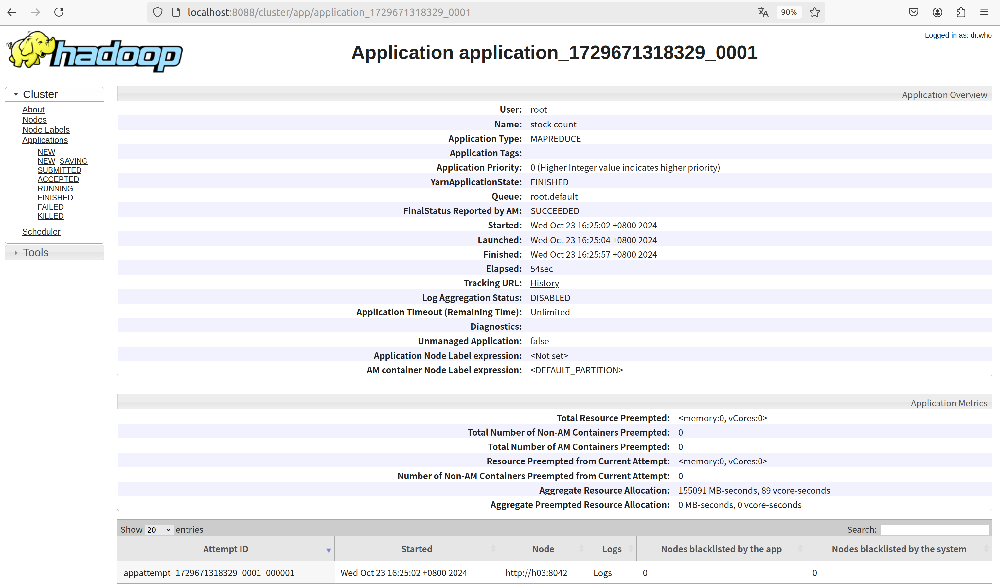
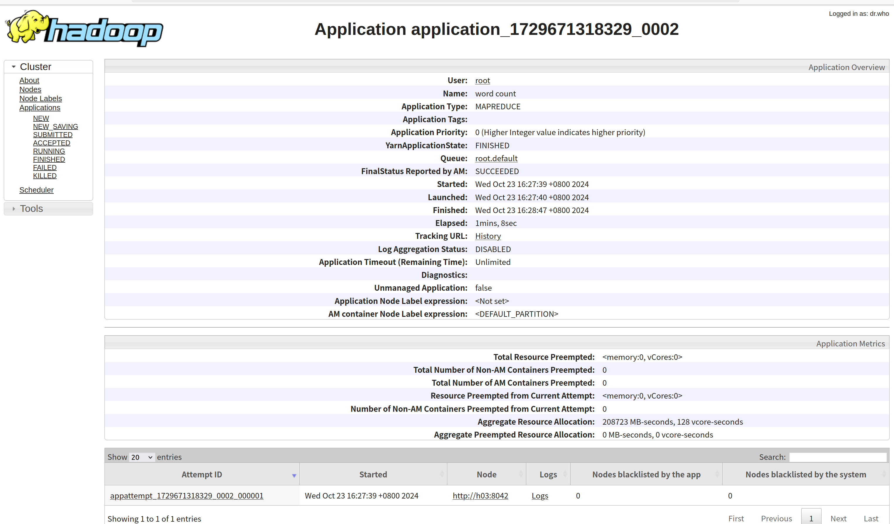

# Hadoop_homework

## 仓库说明
1. 结构与要求基本一致，文件名带`stock`的是任务1有关的，带`word`的是与任务2有关的
2. `src`和`target`分别为虚拟机本地的代码及编译后的文件，push时去掉了`.class`的依赖文件；`src_target_in_docker`文件夹是代码在docker容器中编译结果，与虚拟机本地基本一样，除了少了一些中文注释。
3. 由于任务进行了多次输出，均进行保留，在`output`中的`hw5_output_docker_all_test`中，`fin`开头的两个文件夹为最终成功的输出结果，位于`part-r-00000`中。
4. 由于单文件运行，没有进行maven管理项目，直接编译的，因此没有`pom.xml`文件。

## 任务重述
1. 统计数据集上市公司股票代码（“stock”列）的出现次数，按出现次数从⼤到⼩输出，输出格式为“<排名>：<股票代码>，<次数>”；
2. 统计数据集热点新闻标题（“headline”列）中出现的前100个⾼频单词，按出现次数从⼤到⼩输出。要求忽略⼤⼩写，忽略标点符号，忽略停词（stop-word-list.txt）。输出格式为“<排名>：<单词>，<次数>”。

## 关键命令
```
· 启动docker容器
$ sudo docker start h01 h02 h03 h04 h05
$ sudo docker exec -it h01 /bin/bash
· docker与本地互传文件
本地 -> docker
root@your-vm# docker cp your/local/file <image-name>:your/docker/dest-folder
例如：
root@siwenyu-virtual-machine: home/siwenyu/desktop/Hadoop_homework# docker cp data/analyst ratings.csv h01:/$HADOOP_HONE/hw5_local_input

docker -> 本地
root@your-vm: # docker cp <container-name>:your/docker/dest-folder your/local/file

· 编译java文件
javac -cp $(hadoop classpath) wordcount.java

· 打包成jar文件，依赖文件（.class）都在一个目录下，可以直接运行
jar -cvf wordcount.jar .

· hadoop下执行任务，以下操作均在$HADOOP_HOME路径下运行
// 创建HDFS输入文件夹并上传数据集
hdfs dfs -mkdir -p /user/hadoop/hw5_input
hdfs dfs -put hw5_local_input/analyst_ratings.csv /user/hadoop/hw5_input/

// 上传stop-word-list文件到HDFS
hdfs dfs -put hw5_local_input/stop-word-list.txt /user/hadoop/

// 运行任务1
hadoop jar hw5_build/StockCount.jar StockCount /user/hadoop/hw5_input /user/hadoop/hw5_stock_output
// 运行任务2
hadoop jar hw5_build/wordcount.jar wordcount /user/hadoop/hw5_input /user/hadoop/hw5_word_output /user/hadoop/stop-word-list.txt

// 取出output到docker本地
hdfs dfs -get /user/hadoop/hw5_word_output hw5_local_output

```
## 任务1
### 运行截图（由于实验时忘记截图，重新运行后所截图如下）

### 设计思路
1. Map阶段：`StockCountMapper`类，对输入的csv数据按逗号分割，用最后一列，提取出股票代码，将其作为键，把1作为值，代表出现一次。
2. Reduce阶段：`StockCountReducer`类接收`Mapper`输出的键值对，统计每个股票代码的出现次数，并在`cleanup`方法中将结果按出现次数从大到小排序后输出。
### 性能与拓展性
Mapper：由于只是简单地分割字符串并输出，性能开销较小。但是只是简单地对数据进行逗号分隔，对最后一列要求一定是`stock`列，程序被写死，一旦遇到数据不匹配或者数据缺失、格式不规范等情况，很可能运行错误。
Reducer：使用HashMap进行计数，时间复杂度为O(1)，性能尚可，但是所有数据存储在`mapper`中再给到`reducer`，如果股票种类特别多，`reducer`还只有一个，排序过程中单`reducer`会出现性能短板。`cleanup`方法中的排序操作复杂度应该为`O(nlogn)`。
### 可改进的地方
1. 错误处理：当前代码在处理输入参数和文件路径时没有进行详细的错误处理，可以增加更多的异常处理逻辑以提高程序的健壮性。
2. 排序优化：`cleanup`方法中的排序操作可以通过使用更高效的排序算法（如`reducer`的二级排序）或并行排序来优化。也可以增加`reducer`个数，由不同reducer处理数据
3. 性能提升：在`map`和`reduce`过程中间加入`partition`或`combine`，对数据进行预处理或者分类，都可以减少`reducer`的压力。


## 任务2
### 运行截图（由于实验时忘记截图，重新运行后所截图如下）

### 设计思路

## 性能分析和可能的改进

## 总结
